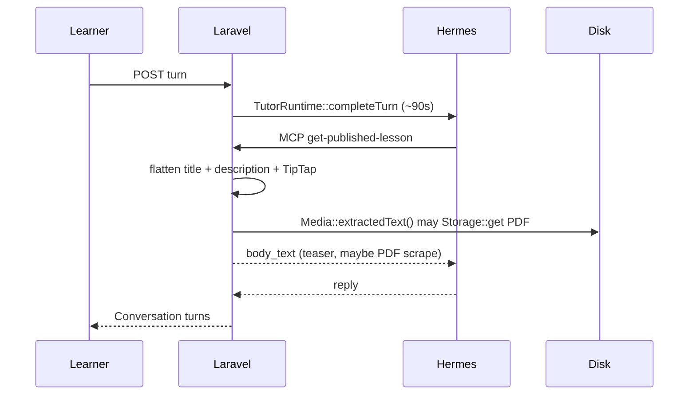
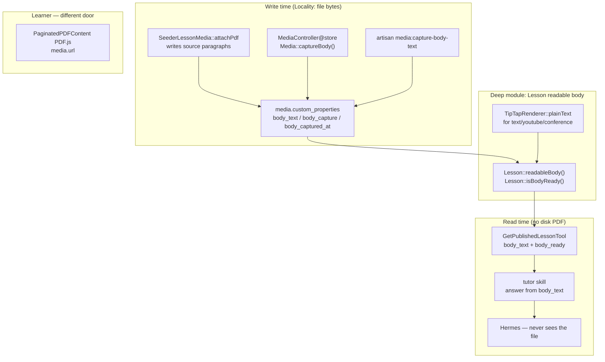
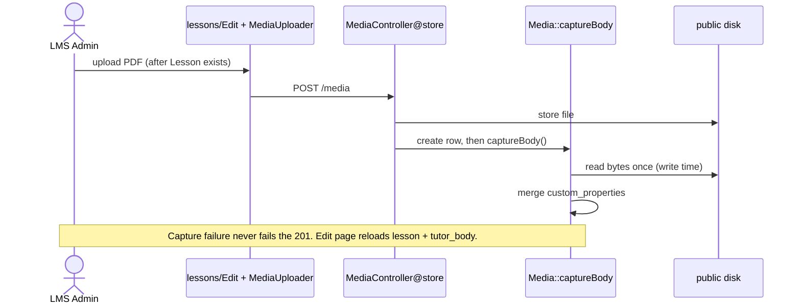

# Lesson Readable Body for the Tutor

| Field | Value |
|---|---|
| **Status** | Draft — Q1–Q4 **decided** (Satriyo, 2026-08-29) |
| **Author** | EnterLMS engineering (for Satriyo) |
| **Date** | 2026-08-29 |
| **Related** | ADR 001 (`docs/adr/001-ai-first-class-lms.md`), CONTEXT.md, `.hermes/skills/tutor/SKILL.md` |
| **Motivating bug** | Tutor told the Learner that OpenClaw is not in the glossary. The Learner was looking at the PDF of *Lembar glosarium agen* (founder shorthand: “Lesson 18”). MCP had returned the TipTap teaser, not the PDF paragraphs. |

---

## Overview

EnterLMS must give the Tutor a **readable Lesson body** when the Lesson is a document (PDF), with a shape that later extends to video/audio transcripts without a second architecture.

The recommendation is **neither** “Laravel parses the PDF on every `completeTurn` / `get-published-lesson`” **nor** “Hermes opens the PDF.” Laravel already owns Lesson and Conversation (ADR 001). It should also own a **text representation of the Lesson body**, captured at **write time** (upload, replace, seed). `get-published-lesson` returns that text. Hermes never sees the file. The PDF stays in Laravel so the Learner can read it with PDF.js (`PaginatedPDFContent.vue`).

Today that is half-done. `GetPublishedLessonTool` concatenates title + description + TipTap teaser **and** `Media::extractedText()`, which prefers `custom_properties.body_text` then **live-scrapes uncompressed `(...) Tj` from PDF bytes**. The scrape is demo-quality (it only works for PDFs we generate in `SeederLessonMedia`). `MediaController@store` already tries extract-on-upload, and the seeder already writes source paragraphs into `body_text`. The live bug is what happens when stored text is missing **or** when the teaser is mixed into `body_text` beside the PDF: MCP silently teaches from the teaser, and the Learner and the Tutor are reading different documents. The first PR that lands `Lesson::readableBody()` must read stored JSON only — never call `extractedText()`.

This design makes **Lesson readable body** a deep module. The Interface is “the readable body of this Lesson.” The Implementation hides PDF parse today and transcription later. One Adapter in v1 (PDF text at write time). A second Adapter later (audio/video transcript) is the test that the Seam is real — not a Strategy tree for one PDF implementation.

---

## Background & Motivation

### Product fact (ADR 001)

- Laravel owns Conversation, Policy, Enrollment, Lesson.
- Tutor brain is Hermes, invoked only via `TutorRuntime::completeTurn`.
- Grounding is `tutor.read` MCP: `GetPublishedLesson` + `GetCourseOutline`, scoped to this `course_id`.
- Grounding is **this Lesson** plus Course outline **titles** — not later Lesson bodies.
- New turns ground in the Lesson **as it is now**; old turns are not rewritten.
- Failed `completeTurn` saves nothing.
- Do not grow Laravel into an agent framework.
- “Grounding lives in the tutor skill + tutor.read MCP — not PHP regex” means PHP must not **decide the pedagogical answer**. PHP **should** supply the Lesson text. Those are different jobs.

Lesson forms (`CONTEXT.md`): text, video, audio, document, YouTube, conference. The Tutor is not a form. A Lesson is not a live OpenClaw console.

### Current code (what actually runs)



Relevant paths:

| Piece | Path | What it does now |
|---|---|---|
| MCP tool | `app/Mcp/Tools/Tutor/GetPublishedLessonTool.php` | `lessonText()` = title + description + flattened `rich_content` + `documentText()` |
| Live scrape | `app/Models/Media.php` `extractedText()` / `extractPdfText()` | Prefer `custom_properties.body_text`, else scan PDF bytes for `(...) Tj` |
| Upload | `app/Http/Controllers/MediaController.php` | After create, if PDF, call `extractedText()` and write `custom_properties = ['body_text' => …]` (overwrites the JSON blob) |
| Seeder | `app/Services/SeederLessonMedia.php` `attachPdf()` | Generates an uncompressed Type1 PDF **and** stores `implode("\n\n", $paragraphs)` as `body_text` |
| Glossary document | `database/seeders/FreeFlowDemoSeeder.php` (*Lembar glosarium agen*) | `content_type=document`; TipTap teaser lists academy terms **without** OpenClaw; PDF paragraphs include OpenClaw |
| Runbook document | `database/seeders/AgentAcademyCourseSeeder.php` | Same pattern: *Runbook kesehatan konektor* |
| Learner UI | `resources/js/components/lesson/PaginatedPDFContent.vue` | PDF.js against `media.url` |
| Runtime | `app/Domain/Tutor/Services/TutorRuntime.php` | CLI or HTTP sidecar, `timeout_seconds` default 90; raises `max_execution_time`. Valet FPM 30s was already a live incident (`config/tutor.php`) |
| Skill | `.hermes/skills/tutor/SKILL.md` | “Document Lessons are the PDF body, not the teaser description.” The skill already states the intended contract; Laravel does not always keep it. |

`composer.json` has **no PDF parser**. Dev-only `barryvdh/laravel-dompdf` generates PDFs; it does not extract. Queue default is `database` (`config/queue.php`); `composer run dev` already runs `queue:listen`. There is **no** `app/Jobs/` yet. `media.custom_properties` is already a JSON column (`database/migrations/2025_11_26_175653_create_media_table.php`).

### Pain

1. **Split brain.** Learner sees PDF.js. Tutor sees TipTap teaser. *Lembar glosarium agen* is the proof: OpenClaw is in the PDF and not in the teaser.
2. **Read-time parse on the Tutor path.** `extractedText()` can `Storage::get` a PDF on every `get-published-lesson`. Hermes may call that tool on every turn. That is the wrong Locality: PDF bytes on the 90s `completeTurn` budget, after an FPM 30s incident.
3. **Demo scraper presented as extraction.** `(...) Tj` works for `SeederLessonMedia` streams. Real LMS-Admin uploads (`StoreMediaRequest` allows 50MB `pdf,doc,docx,ppt,pptx,…`) will usually yield `''`. Then MCP falls through to the teaser and the bug returns.
4. **Half-done write-time path.** Upload and seeder already try to store `body_text`. MCP still scrapes. Controller overwrites `custom_properties` instead of merging. The read path does not trust the write path.

### Scale (honest, this academy)

Not production. v1 catalog is two Courses. Document Lessons today: two seeded PDFs (glossary + runbook), each ~10 short paragraphs, `body_text` ≈ 1–3 KB. Upload ceiling is 50MB/document. A 20-page text PDF is tens of KB of extracted text — fine as an MCP JSON field. A scanned 50MB PDF has **no text layer**; extraction must fail loudly, not silently teach the teaser. Transcription (later) is minutes, not milliseconds — that is why the Seam must not live inside `completeTurn`.

---

## Goals & Non-Goals

### Goals

- One Interface: **the readable body of this Lesson**, consumed by `get-published-lesson` as `body_text`.
- Capture at **write time** (seed, upload, replace, backfill). MCP is a **read** of stored text.
- Hermes never receives a path, signed URL, or bytes. No new filesystem/URL door on `tutor.read`.
- Document Lessons ground on the PDF text, not the TipTap teaser.
- Failed capture does **not** silently substitute the teaser as if it were the PDF.
- A later audio/video transcript reuses the same stored-text slot and the same Lesson Interface. No second architecture.
- Ban `extractedText()` from `Lesson` and `GetPublishedLessonTool` in the first PR (`storedBodyText()` is JSON-only). Delete the live `(...) Tj` scrape from `Media` once write-time capture lands.
- Tests at the module Interface (MCP / `Lesson::readableBody()`), not at the scraper internals.

### Non-Goals

- Not an agent framework, not PHP pedagogy, not stuffing the PDF into `TutorRuntime::prompt()`.
- Not OCR of scanned PDFs.
- Not transcribing video/audio in v1 (only reserve the Seam).
- Not extracting Word/PowerPoint in v1 (those mimes are already accepted for download; they stay Learner-downloadable and **not** Tutor-grounding until a later Adapter).
- Not a Strategy / Contract / factory for PDF vs transcript (ADR 008 lesson: one implementation is a `match` arm, not a resolver).
- Not adding a Composer PDF package in v1 (Q1 decided: no).
- Not rewriting old Conversation turns when a PDF is replaced (ADR 001: new turns use the Lesson as it is now).
- Not a second Tutor gate on unpublish / “not tutorable.” If the Learner can open the Lesson, they can talk (ADR 001). Missing body is a **grounding** problem, not an Enrollment problem.
- Not showing extracted text to the Learner (they have PDF.js).

---

## Key Decisions

| # | Decision | Rationale |
|---|---|---|
| D1 | **Write-time capture, MCP read-only.** Neither live extract inside `completeTurn` nor Hermes opening the file. | Right Locality. ADR 001: Laravel owns Lesson; Hermes consumes `tutor.read`. FPM/Hermes timeout budget stays for the model, not for PDF bytes. |
| D2 | **The Module is Lesson readable body.** Interface: `Lesson::readableBody()` + `Lesson::isBodyReady()`. Not a new bounded context, not a Strategy tree. | Models own behavior. MCP stays thin. Depth hides content_type + parse. |
| D3 | **Stored text lives on Media** (`custom_properties.body_text` + capture metadata). Lesson **assembles**; Media **stores the file’s text**. | Replacement of a PDF is a Media write. Future transcripts are per-file. Seeder already writes this key. No new table. No lesson-level duplicate column. |
| D4 | **Document `body_text` is not the teaser.** For `content_type=document`, readable body = title + stored PDF text. Keep `description` as metadata. Omit / `null` `body_html` on document Lessons so the only full-body field is `body_text`. Skill ignores `body_html` for `content_type=document` even when `body_ready` is true. | This is the actual bug. Concatenating teaser + (empty scrape) taught the Tutor the teaser. The teaser still lists academy terms without OpenClaw; leaving it in `body_html` is a competing document. |
| D5 | **No live scrape on read, starting in PR 1.** `Lesson` and `GetPublishedLessonTool` call `Media::storedBodyText()` (JSON only). They must not call `extractedText()`. PR 2 moves the `(...) Tj` parser to write-time and deletes the dead read method. | A hedge that “prefers stored text then scrapes” re-introduces the Locality bug. `isBodyReady()` would be true for a generated PDF with no JSON. |
| D6 | **v1 Adapter = source paragraphs (seeder) + write-time Tj Adapter for generated PDFs only. No Composer PDF package.** | **Decided (Satriyo, 2026-08-29), Q1.** Seeded PDFs are honest because we store the source paragraphs. Typical Admin uploads may `failed` and must **surface** that. |
| D7 | **Sync capture on PDF upload in v1.** No `Job` class until transcription or a real parser needs it. `Media::captureBody()` is the Seam a future Job will call. | Anti-over-engineering. `composer run dev` already has a worker, but a Job for a 3KB glossary is ceremony. Transcription will need the Job; PDF text today does not. |
| D8 | **Missing document body: still talk with `body_ready=false`.** Do not reject the turn. Do not add a publish gate. Do not fake the PDF as the teaser. | **Decided (Satriyo, 2026-08-29), Q3.** ADR 001: if they can open the Lesson, they can talk. Silent teaser is the bug. |
| D9 | **LMS Admin can view captured text in v1; no textarea editor.** Learner never sees it. | **Decided (Satriyo, 2026-08-29), Q2.** Admin must know what the Tutor will ground on. |
| D10 | **Hermes gets no file door.** `get-published-lesson` must not add `url`, `path`, `disk`, or bytes. | `tutor.read` is read-only Course text. A signed URL is a new capability on that token. |
| D11 | **Video/audio in v1: TipTap + description is an acceptable Tutor body.** `isBodyReady()` is `true` for those forms until transcripts exist. | **Decided (Satriyo, 2026-08-29), Q4.** Do not block those forms. The stored-text slot stays unused until a transcript Adapter writes it. |

---

## Proposed Design

### Design-it-twice vocabulary

**Module.** *Lesson readable body* — the text the Tutor is allowed to ground on for this Lesson, as it is now.

**Interface.** Two methods on `Lesson`, plus the existing MCP field `body_text`:

```php
// app/Models/Lesson.php
public function readableBody(): string
public function isBodyReady(): bool
```

Callers: `GetPublishedLessonTool` and the LMS Admin **edit** page (`tutor_body` prop only — not create). Learner Inertia must **not** append this onto `LessonResource` — a glossary is small; a future transcript is not, and the Learner already has the file.

**Implementation.** Internal `match` on `$this->content_type` (and media mime). Not a Contract, not a tagged Strategy, not a factory. ADR 008 applies.

**Depth.** Callers never mention PDF dictionaries, `Tj`, Whisper, or storage disks. They ask for the body.

**Seam.** Write-time `Media::captureBody(): void` stores text on the file. Read-time `Media::storedBodyText(): string` never opens the file. A later Job calls `captureBody()`. A later transcript Adapter writes the same `body_text` key.

**Adapter.** v1: PDF text. Implementation inside `captureBody()`:

1. If `custom_properties.body_text` is already a non-empty string **and** this call is not a forced recapture → leave the text (seeder writes source paragraphs; do not round-trip through the scraper). May stamp `body_capture=ready`.
2. Else if `mime_type === 'application/pdf'` → v1 extract (Tj scrape of uncompressed generated PDFs only; Q1 = no real parser). Write `body_text` + `ready`/`failed`.
3. Else → stamp `body_capture = unsupported` **without clearing `body_text`**. Never force-empty a future audio/video transcript because the Adapter did not try that mime.

**Leverage.** One MCP shape (`body_text`, `body_ready`, `content_type`) serves text, document, and later transcript Lessons. One skill paragraph. One test style.

**Locality.** Bytes are touched on the write request (or a future Job). `completeTurn` and MCP stay JSON.



### Interface (what “readable body” means per form)

| `content_type` | `readableBody()` | `isBodyReady()` |
|---|---|---|
| `text` | title + description + TipTap plain text | always `true` (body **is** the TipTap) |
| `youtube`, `conference` | title + description + TipTap plain text | always `true` |
| `document` | title + stored text of document media (PDF). **Not** description, **not** TipTap teaser | `true` iff at least one document media has non-empty `storedBodyText()` |
| `video`, `audio` (v1) | title + description + TipTap (today’s teaser / notes). **No** stored-media call. | `true` in v1 (transcript is not required yet) |
| `video`, `audio` (later) | title + stored transcript (`storedBodyText()`) when present — add this arm explicitly in optional PR 4 | Product call then; v1 stays `true` on notes-only (Q4 decided) |

This is the test of the Seam: adding a transcript Adapter changes `captureBody()` and the `video`/`audio` arms. It does **not** change MCP, skill grounding, or `completeTurn`. Do not leave a dangling `mediaStoredText()` in v1.

### Implementation sketch

```php
// app/Models/Lesson.php — Interface of the Module
public function readableBody(): string
{
    $this->loadMissing('media');

    $parts = match ($this->content_type) {
        'document' => array_filter([
            $this->title,
            $this->documentStoredText(),
        ]),
        default => array_filter([
            $this->title,
            $this->description,
            is_array($this->rich_content)
                ? app(TipTapRenderer::class)->plainText($this->rich_content)
                : null,
        ]),
    };

    return trim(implode("\n\n", $parts));
}

public function isBodyReady(): bool
{
    if ($this->content_type !== 'document') {
        return true;
    }

    $this->loadMissing('media');

    return $this->documentStoredText() !== null;
}

private function documentStoredText(): ?string
{
    $texts = $this->media
        ->filter(fn (Media $media): bool => $media->is_document)
        ->map(fn (Media $media): string => $media->storedBodyText())
        ->filter(fn (string $text): string => $text !== '');

    return $texts->isEmpty() ? null : $texts->implode("\n\n");
}
```

```php
// app/Models/Media.php — storage (PR 1) + write-time Adapter (PR 2)
public const CAPTURE_MAX_BYTES = 8 * 1024 * 1024; // 8 MiB; skip Storage::get above this

public function storedBodyText(): string
{
    $properties = $this->custom_properties ?? [];
    $stored = is_array($properties) ? ($properties['body_text'] ?? null) : null;

    return is_string($stored) ? $stored : '';
}

public function captureBody(bool $force = false): void
{
    if (! $force && $this->storedBodyText() !== '') {
        $this->mergeCaptureMeta('ready');

        return;
    }

    if ($this->mime_type !== 'application/pdf') {
        // Stamp status only. Never write body_text='' — that would wipe a
        // future audio/video transcript if someone calls captureBody(true)
        // on the wrong row.
        $this->mergeCaptureMeta('unsupported');

        return;
    }

    $text = $this->extractPdfTextAtWriteTime();
    $this->writeBodyCapture($text, $text === '' ? 'failed' : 'ready');
}

private function extractPdfTextAtWriteTime(): string
{
    if ($this->size > self::CAPTURE_MAX_BYTES) {
        return '';
    }

    if ($this->path === '' || ! Storage::disk($this->disk)->exists($this->path)) {
        return '';
    }

    return $this->extractUncompressedTjForGeneratedPdfs(
        (string) Storage::disk($this->disk)->get($this->path)
    );
}

/** Public: controller catch path and captureBody() both use this. Leaves body_text unchanged. */
public function mergeCaptureMeta(string $status): void { /* body_capture, body_captured_at */ }

/** Merge status keys and set body_text (PDF path only). */
private function writeBodyCapture(string $text, string $status): void { /* … */ }
```

`storedBodyText()` lands in **PR 1**. It reads JSON only. It does not call `extractedText()`, does not `Storage::get`. `Lesson::documentStoredText()` maps `storedBodyText()`. `extractedText()` may still exist on the class until PR 2 deletes it; **Lesson and the MCP tool must not call it.**

Move TipTap flattening out of the MCP tool into `TipTapRenderer::plainText()`. That **deletes** `GetPublishedLessonTool::flattenRichContent()` and `documentText()`.

v1 `plainText()` contract: this is an allowed improvement over today’s space-join (`flattenRichContent()` concatenates text nodes with spaces and no paragraph breaks). Paragraph / `hardBreak` → `"\n\n"` / `"\n"`. Do **not** require bit-identical flatten for text Lessons. Update MCP text-lesson assertions to match the new whitespace.

```php
// app/Mcp/Tools/Tutor/GetPublishedLessonTool.php — thin read
$bodyHtml = $lesson->content_type === 'document'
    ? null
    : (new TipTapRenderer)->render($lesson->rich_content);

return Response::structured([
    'ok' => true,
    'data' => [
        'course_id' => $course->id,
        'lesson_id' => $lesson->id,
        'title' => $lesson->title,
        'description' => $lesson->description,
        'content_type' => $lesson->content_type,
        'body_text' => $lesson->readableBody(),
        'body_ready' => $lesson->isBodyReady(),
        'body_html' => $bodyHtml,
    ],
]);
```

Do **not** add `url` / `path` / `disk`. For `content_type=document`, `body_html` is `null` so the teaser is not a second full-body field. `description` stays as metadata. The skill must ignore `body_html` on document Lessons even if a client sends a cached payload that still has it.

### When capture runs



| Event | What runs | Notes |
|---|---|---|
| `SeederLessonMedia::attachPdf()` | Writes `body_text` from `$paragraphs` plus `body_capture=ready` / `body_captured_at`. Does **not** parse the generated PDF. | Honest source. `captureBody()` sees non-empty text and no-ops unless `$force`. |
| `SeederLessonMedia::attachFixture()` (audio/video) | No `body_text`. | v1 correct. |
| `MediaController@store` | After create, `try { $media->captureBody(); } catch (Throwable)`. | Merge, don’t replace, `custom_properties`. Only PDFs attempt extract. Exceptions → log + `body_capture=failed`; still **201**. |
| Media replace | Destroy + new store (current UI). New row → new capture. | Old body_text dies with the row. New turns see the new Lesson. Old Conversation turns stay (ADR 001). |
| `MediaController@destroy` | Delete file + row. | Document Lesson may become `body_ready=false`. |
| Artisan `media:capture-body-text {--force}` | `Media::query()->where('mime_type','application/pdf')->each->captureBody($force)` | PDF-only. Backfill *Lembar glosarium agen* if the DB was seeded before `body_text` existed. |
| `completeTurn` / MCP | **Nothing.** Read `storedBodyText()`. | |

Sync vs queue: v1 **sync** on the upload request. PDF capture of our generated files is milliseconds.

`StoreMediaRequest` allows 50MB documents. PHP cannot catch memory exhaustion. **Do not `Storage::get` a 50MB string on the upload request.** `extractPdfTextAtWriteTime()` returns `''` (→ `failed`) when `size > Media::CAPTURE_MAX_BYTES` (8 MiB) or the path `exists()` is false. 8 MiB is enough for the academy’s text PDFs; a 50MB scan/compress dump is marked failed without loading bytes. Transcription later **must** be `ExtractMediaBodyJob` calling the same `captureBody()`.

Do not block the 201 response on a missing parser, a throw, or a too-large file. Capture failure is a property on Media, not an HTTP 500. The file is still stored; the Learner can still open it.

```php
// app/Http/Controllers/MediaController.php — after create
try {
    $media->captureBody();
} catch (Throwable $e) {
    Log::warning('media.body_capture', [
        'media_id' => $media->id,
        'status' => 'failed',
        'error' => $e->getMessage(),
    ]);
    $media->mergeCaptureMeta('failed'); // do not wipe any text already stored
}
```

### What to delete

Split across PRs so Lesson never depends on the scrape:

**PR 1**

- Add `Media::storedBodyText()` (JSON only).
- `Lesson` / MCP call **only** that. Ban `extractedText()` from those files.
- Delete `GetPublishedLessonTool::{lessonText, documentText, flattenRichContent}`.
- Leave `extractedText()` / `extractPdfText()` on `Media` for one PR so upload’s current call still compiles; they are dead to the Tutor path.

**PR 2**

- Delete `Media::extractedText()` and the read-path `extractPdfText()`.
- Keep a **private** write-time Tj Adapter named so it cannot be mistaken for production PDF support, e.g. `extractUncompressedTjForGeneratedPdfs()`.
- Delete / rewrite `tests/Unit/Models/MediaExtractedTextTest.php` (it currently **strips** `custom_properties` and asserts scrape-when-missing — that test **cements the wrong Locality**).
- Stop `MediaController` from assigning `custom_properties => ['body_text' => …]` (it clobbers other keys). Use merge via `writeBodyCapture()` / `mergeCaptureMeta()`, inside `try/catch`.

### Skill contract (small additive change)

`.hermes/skills/tutor/SKILL.md` already says document Lessons are the PDF body. Add:

- If `body_ready` is false on a `document` Lesson: say you cannot see the document body yet; do **not** treat `description` / `body_html` as the glossary / runbook.
- When `content_type` is `document`, **ignore `body_html` even if `body_ready` is true** (and even if a payload still includes HTML). Grounding is `body_text` only. `description` is metadata, not the glossary.
- Still refuse *operating* live OpenClaw; still explain OpenClaw **when it is in `body_text`**.
- `tests/Feature/Tutor/TutorSkillContractTest.php` must require the `body_ready` sentence **and** the “document → ignore `body_html`” sentence.

### LMS Admin UI (view, not a second editor)

`lessons/Edit.vue` is also the **create** page. `LessonController@create` already renders it with `'lesson' => null` and no extra props (`app/Http/Controllers/LessonController.php`). Media upload is already gated on `isEditMode && lessonId`. Do **not** pass `tutor_body` from `create()`.

On **edit** only, `LessonController@edit` already loads `media`. Pass an extra Inertia prop (not on Learner `show`):

```php
'tutor_body' => [
    'ready' => $lesson->isBodyReady(),
    'text' => $lesson->content_type === 'document' ? $lesson->readableBody() : null,
    'capture' => $lesson->media
        ->filter(fn (Media $m) => $m->is_document)
        ->map(fn (Media $m) => [
            'id' => $m->id,
            'file_name' => $m->file_name,
            'status' => $m->custom_properties['body_capture'] ?? 'missing',
        ])->values(),
],
```

Vue contract: `tutor_body` is **optional**.

```ts
interface Props {
    section: Section;
    lesson: Lesson | null;
    tutor_body?: TutorBody | null;
}

withDefaults(defineProps<Props>(), { tutor_body: null });
```

Guard the preview with `isEditMode && tutor_body`. A required prop will break create (Inertia missing-prop / Vue warn). Partial reload of `tutor_body` on create never happens — upload is already blocked until the Lesson exists.

`tutor_body` is a **top-level Inertia prop** on **edit**, not a field on `LessonResource`. Live `resources/js/pages/lessons/Edit.vue` already does:

```ts
const handleMediaUploaded = () => {
    router.reload({ only: ['lesson'] });
};
```

Same for delete. A partial reload of `lesson` will **not** re-request `tutor_body`. After a PDF upload the Media list would update and “Teks yang dibaca Tutor” would stay stale until a full reload.

PR 3 **must** change both handlers to:

```ts
router.reload({ only: ['lesson', 'tutor_body'] });
```

`lessons/Edit.vue` + `LessonContentEditor.vue`: for `document` **and** `isEditMode && tutor_body`, a read-only block under `MediaUploader`, driven by `tutor_body` (not by the XHR body):

- Ready: “Teks yang dibaca Tutor” in a scrollable `<pre>` (Tenang tokens, not a stock hue).
- Failed / missing: warn in Bahasa Indonesia — “Tutor tidak melihat isi PDF ini. Di v1, unggah ulang PDF terkompresi akan gagal lagi. Pulihkan PDF academy dengan seed ulang. Parser dan suntingan teks tidak ada di v1.”

Do **not** invent a second `warning` emit on `MediaUploader.vue`. `MediaUploader` only emits `error` on non-2xx; a 201 with failed capture is a successful upload of a file the Tutor cannot read. The edit page warning after `tutor_body` reload is enough. Do **not** add `body_capture` to the 201 JSON as a UI contract (optional log field is not consumed).

Do **not** put `body_text` or `custom_properties` on `MediaResource`. `LessonResource` already embeds `MediaResource::collection($this->media)` on Learner `show`. `resources/js/types/models/lesson.ts` `Media` currently declares `custom_properties` — that drift must **not** be “fixed” by adding the JSON blob to the resource (that leaks the glossary into Learner Inertia). If TS must change, add a separate `TutorBody` type for the edit prop; do **not** widen `Media`.

`MediaResource` stays file metadata + `url` for PDF.js.

### Backfill / *Lembar glosarium agen* migration

Not production; breaking changes allowed. Numeric lesson id is not stable (depends on seeder order with the restricted course). Identity is the title *Lembar glosarium agen*.

1. Re-seed is sufficient for local: `FreeFlowDemoSeeder` / `AgentAcademyCourseSeeder` already call `attachPdf(..., paragraphs: …)` which writes `body_text`.
2. For a DB that already has that Lesson **without** `custom_properties.body_text`, run `php artisan media:capture-body-text`. v1 Tj Adapter will recover **our** generated PDFs. It will not recover a typical compressed Admin upload — re-upload of those will fail again (Q1 = no parser; Q2 = no manual edit).
3. After backfill, `get-published-lesson` on *Lembar glosarium agen* must contain `OpenClaw: runtime agen` **in structured `data.body_text`**. That is the acceptance test of the motivating bug.

### v1 PDF Adapter honesty

Until a package is approved, we **do not claim** general PDF support.

| Source | How text is obtained | Honest? |
|---|---|---|
| Seeder PDFs | Source `$paragraphs` stored at attach | Yes |
| Existing generated PDFs missing `body_text` | Write-time Tj scrape (same generator) | Yes, for this generator only |
| LMS Admin upload of a typical compressed PDF | Capture `failed` | Yes, if we **show** the failure. Re-upload will fail again in v1 (Q1 = no parser). |
| Scanned PDF | Capture `failed` (no OCR) | Yes |
| docx / pptx | `unsupported` | Yes |

Q1 decided: **no parser in v1.** `extractPdfTextAtWriteTime()` stays the generated-PDF Tj Adapter. A later product revisit (not PRs 1–3) would swap only that method. Candidates if revisited: `smalot/pdfparser`, or poppler `pdftotext` via `Process`. Do not add either now.

---

## API / Interface Changes

### MCP `get-published-lesson` (keep `body_text`, add `body_ready`)

Before (conceptual):

```json
{
  "ok": true,
  "data": {
    "course_id": 1,
    "lesson_id": 1,
    "title": "Lembar glosarium agen",
    "description": "Satu halaman istilah yang dipakai academy ini.",
    "content_type": "document",
    "body_text": "<title>\\n\\n<description>\\n\\n<teaser TipTap>\\n\\n<maybe scraped PDF>",
    "body_html": "<p>Unduh atau baca PDF ini…</p>"
  }
}
```

After:

```json
{
  "ok": true,
  "data": {
    "course_id": 1,
    "lesson_id": 1,
    "title": "Lembar glosarium agen",
    "description": "Satu halaman istilah yang dipakai academy ini.",
    "content_type": "document",
    "body_text": "Lembar glosarium agen\n\nAgen AI: …\n\nOpenClaw: runtime agen. …",
    "body_ready": true,
    "body_html": null
  }
}
```

When capture failed:

```json
{
  "body_text": "Lembar glosarium agen",
  "body_ready": false,
  "body_html": null
}
```

`description` stays (metadata). `body_html` is `null` for document Lessons so PHP is not supplying a contradictory full-body teaser. The skill still says: when `content_type` is `document`, ignore `body_html` even if present. PHP does not regex the pedagogical answer.

No new MCP tool. No file-fetch tool.

### HTTP upload (`POST /media`)

Response stays `{ message, media: MediaResource }` with **201** whether capture is `ready` or `failed`. Do not add `body_capture` to this JSON as a UI contract (MediaUploader only treats non-2xx as `error`; wiring a 201 warning would require changing `MediaUploader.vue`, which this design does not). The LMS Admin warning lives on the edit page via `tutor_body` after `router.reload({ only: ['lesson', 'tutor_body'] })`.

### Artisan

```
php artisan media:capture-body-text [--force] [--media=ID]
```

Idempotent. `--force` re-runs extract even when `body_text` is present (not the default: would clobber seeder source paragraphs with a scrape).

### TutorRuntime / ConversationService

**No change.** `completeTurn` still sends Course/Lesson/Conversation ids. Hermes still calls MCP. Failed completeTurn still saves nothing.

---

## Data Model Changes

No new table. No new required Composer package.

`media.custom_properties` JSON shape (additive keys; seeder already uses `body_text`):

```php
/**
 * @phpstan-type MediaBodyProperties array{
 *     body_text?: string,
 *     body_capture?: 'ready'|'failed'|'unsupported',
 *     body_captured_at?: string
 * }
 */
```

| Alternative | Why not (v1) |
|---|---|
| `media.body_text` LONGTEXT column | Cleaner to query; needs a migration. We have two PDFs and a JSON column already. Promote later if we full-text-search Lesson bodies. |
| `lessons.body_text` | Duplicates the file. Replace-PDF then has two sources of truth. Transcripts are per media. |
| `lesson_bodies` table | A table for two rows is the ROUND9 class of over-engineering. |

Backfill is an artisan command, not a schema migration. Existing *Lembar glosarium agen* rows with `custom_properties.body_text` already set (current seeder) need no rewrite.

`MediaFactory::document()` should gain an optional state `withBodyText(string $text)` for tests that must not hit disk.

---

## Alternatives Considered

### 1. Live extract inside `GetPublishedLessonTool` / `completeTurn` (status quo)

**How.** Keep `Media::extractedText()` scrape on MCP read; maybe even parse inside `TutorRuntime`.

**Trade-offs.**

| + | − |
|---|---|
| No stored derived data | Hits disk on every turn; scrape fails on real PDFs; teaser fallback is the bug |
| Matches “always as it is now” without backfill | Wrong Locality: 50MB `Storage::get` on the 90s Hermes budget; FPM 30s already bit us |
| | PHP is not deciding pedagogy, but it is pretending to parse PDFs in the read path |

**Verdict.** Reject as the long-term design. The current scrape is a demo that leaked into production shape.

### 2. Hermes fetches the PDF (path, signed URL, or bytes)

**How.** MCP returns `media.url` or a signed route; skill says “read the PDF.” Or Laravel shells `hermes` with a file path.

**Trade-offs.**

| + | − |
|---|---|
| “The model can see what the Learner sees” | New door on `tutor.read`: fetching files |
| No PHP parser | HTTP sidecar (`TUTOR_RUNTIME_URL`) **cannot** read Valet `storage/app` paths. Bytes in the prompt blow context. PDF-to-text inside Hermes is slow and non-deterministic, and sits in the 90s timeout |
| | Skill grounding becomes “maybe the model’s PDF reader worked.” Tests cannot pin OpenClaw in `body_text` |
| | Violates ADR 001 Locality: Laravel owns Lesson; Hermes is not a storage client |
| | Signed URLs on a Sanctum token are a capability expansion, not a parser |

**Verdict.** Reject. No Hermes filesystem/URL door.

### 3. Write-time extract, store text, MCP returns text (this design)

**How.** As above.

**Trade-offs.**

| + | − |
|---|---|
| One Interface for PDF and later transcripts | Derived data can drift if we forget to recapture on replace (mitigate: capture is on store; replace is destroy+store) |
| MCP is a cheap JSON read | Without a real parser, Admin-uploaded PDFs often `failed` |
| Fixes *Lembar glosarium agen* without duplicating content | Admin must be able to **see** failure |
| Deletes live scrape | `custom_properties` is a bit unstructured (acceptable at this scale) |

**Verdict.** Accept.

### 4. Duplicate the glossary into `rich_content` so MCP never needs the PDF

**How.** Copy OpenClaw paragraphs into TipTap. `get-published-lesson` keeps flattening `rich_content`. PDF is “for the Learner only.”

**Trade-offs.**

| + | − |
|---|---|
| Fixes *Lembar glosarium agen* this afternoon with a seeder edit | Two sources of truth the next time LMS Admin edits the PDF |
| No parser, no `body_text` | Runbook Lesson has the same bug waiting. Video/audio transcripts have nowhere to go |
| | Teaches the wrong lesson: “keep the TipTap in sync by hand” |

**Verdict.** Reject as architecture. Acceptable only as an **emergency content hotfix** if we cannot ship PRs before a demo — and even then, still store `body_text` from the same paragraphs (the seeder already can).

### Why not a Strategy tree?

A `LessonBodyExtractorContract` with `PdfExtractor` / `TranscriptExtractor` / `TipTapExtractor` and a tagged resolver is the ADR 008 pattern with one implementation. Content type is already a column on `Lesson`. `match ($this->content_type)` is the selector that **exists**. A second Adapter later is another `match` arm and another branch inside `captureBody()`, not a container tag.

---

## Security & Privacy Considerations

| Threat | Severity | Mitigation |
|---|---|---|
| `tutor.read` token used to fetch Lesson files (signed URL / path) | High if we built alt #2 | Do not expose URL/path/bytes on MCP. Token stays read-only JSON. |
| Extracted glossary/runbook text in Learner Inertia payload | Low–med | `readableBody()` is not on `LessonResource`. Admin-only `tutor_body` prop on edit. Do not add `custom_properties` / `body_text` to `MediaResource` even though the TS `Media` type currently declares `custom_properties`. |
| LMS Admin sees raw extracted text | Intended | Policy: `update` on Lesson (already `LessonController@edit`). Learner cannot hit that route. |
| Prompt injection via PDF text | Med (inherent) | Same as TipTap body today. Skill still refuses enroll/complete/shell. Do not add tools. |
| Path traversal in scrape | N/A once scrape is write-time on `$this->path` via Storage | Keep using `Storage::disk($this->disk)->get($this->path)`. Never pass client paths. |
| 50MB PDF in memory during capture | Med | Skip `Storage::get` when `size > 8 MiB`; mark `failed`. Controller `try/catch (Throwable)` so extract throws never 500 the 201. PHP OOM is not catchable — the byte ceiling is the mitigation. File still stored. |
| Overwriting `custom_properties` | Low | Merge keys (fixes current controller bug). |
| Restricted Course Lesson body on `tutor.read` | Already true | `GetPublishedLessonTool` already allows published restricted Courses. Enrollment is **not** re-checked on MCP (Hermes is the academy’s process). Do not change that here. |

Privacy: extracted text is Course content the LMS Admin already uploaded. No new PII store. Do not log full `body_text` at info level (can be large later). Log `media_id`, `status`, `bytes`, `chars`.

---

## Observability

Use existing `DomainLogger` / `Log::` — do not invent a metrics product.

On `captureBody()`:

```php
Log::info('media.body_capture', [
    'media_id' => $this->id,
    'mime_type' => $this->mime_type,
    'status' => $status,          // ready|failed|unsupported
    'chars' => mb_strlen($text),
    'size' => $this->size,
]);
```

On MCP, `AuditsAgentToolCalls` / `AgentActionLogger` persist **arguments**, not the structured tool result. `body_text` is not already landing in `agent_action_logs`. Do not start logging the MCP payload.

Alerting (human, v1): LMS Admin warning on the Lesson edit page is the alert. There is no on-call.

Metric (optional, `MetricsService`): `media.body_capture.ready` / `.failed` counters. Skip if it takes more than a few lines — two PDFs do not need a dashboard.

---

## Rollout Plan

Not production. No feature flag required.

1. **Land Interface + MCP assembly** (document Lessons stop mixing teaser; `storedBodyText()` JSON-only). Seeded *Lembar glosarium agen* starts working **if** `body_text` is already on the row (current seeder).
2. **Land write-time capture + delete read scrape + backfill command.** New uploads store text or fail visibly (201 + `body_capture=failed`, never HTTP 500).
3. **Admin view** of captured text so the founder can see what the Tutor sees. Edit page reloads `lesson` **and** `tutor_body` after media XHR.
4. **Optional later (not v1):** transcripts (PR 4). A real parser is **out of v1** (Q1 = no).

**v1 recovery for a failed Admin upload** (Q1 = no parser; Q2 = view-only): re-upload of a typical compressed PDF **will fail again**. Recovery is re-seed for academy PDFs. Typical Admin uploads stay unread by the Tutor in v1. The Admin warning must say that; do not imply a second upload will help.

**Rollback.** Revert the PR. Worst case: MCP returns teaser-only again (known bug). Capture metadata in JSON is additive and harmless if unused. No schema down-migration.

**Hermes skill** deploy is a file in this repo (`.hermes/skills/tutor/SKILL.md`); it ships with the PHP change. Preload remains `hermes chat -s tutor`.

---

## Risks

| Risk | Severity | Mitigation |
|---|---|---|
| Admin uploads a real PDF; capture fails; Tutor still sounds like it “read” the teaser | **High** (the original bug) | `content_type=document` must not concatenate teaser into `body_text`. Skill: `body_ready=false` → do not invent. UI warning. |
| Treating Tj scrape as general PDF support | High (product lie) | Document honesty table. Failed status. Q1 decided: no parser. Admin copy: re-upload of a typical PDF fails again. |
| Forgetting capture on a future in-place update path | Med | Today replace = destroy+store. If we add update-in-place, it must call `captureBody()`. Test on upload is the contract. |
| `loadMissing('media')` N+1 if someone maps `readableBody()` over a Course | Med | Callers are MCP (`GetPublishedLessonTool` eager-loads `media`) and a single-Lesson edit prop (`LessonController@edit` already `load('media')`). Do not map `readableBody()` over a Course. Create does not call it. |
| Large `body_text` in Hermes context | Low now, med later | Glossary is KB. Later: truncate with a logged limit, or chunk — out of v1. |
| Queue-before-talk race (if we Job too early) | Med | Don’t Job PDF in v1. When transcription Jobs exist, `body_ready=false` is the correct interim. |

---

## Open Questions

**Decided (Satriyo, 2026-08-29).** Locked. Do not re-litigate in PRs 1–3.

### Q1. Approve a real PDF extraction package (or `pdftotext` binary) in v1?

- **Options:** (a) no — seeder source paragraphs + Tj Adapter for our generated PDFs only; Admin uploads may `failed`; (b) Composer `smalot/pdfparser`; (c) poppler `pdftotext` via `Process`.
- **Decided (Satriyo, 2026-08-29):** **(a) no new package.** Seeder source paragraphs + write-time Tj Adapter for generated PDFs only. Typical Admin uploads may fail capture. No Composer dep in PRs 1–3. Admin warning: re-upload of a typical compressed PDF will fail again.

### Q2. May LMS Admin **edit** captured `body_text`?

- **Options:** (a) view-only; (b) textarea that writes `custom_properties.body_text` and sets `body_capture=ready`; (c) no UI at all — only logs.
- **Decided (Satriyo, 2026-08-29):** **(a) view-only.** LMS Admin sees captured text on Lesson edit. No textarea editor in v1.

### Q3. Document Lesson without `body_text`: refuse Tutor, or talk with `body_ready=false`?

- **Options:** (a) still talk, skill admits the document body is missing; (b) `ConversationService::postTurn` rejects with a Bahasa Indonesia error; (c) Course `publish()` refuses while any document Lesson is not ready.
- **Decided (Satriyo, 2026-08-29):** **(a) still talk with `body_ready=false`.** Do not reject the turn. Do not add a publish gate.

### Q4. For video/audio in v1, is the TipTap teaser an acceptable Tutor body until transcripts exist?

- **Decided (Satriyo, 2026-08-29):** **Yes.** Video/audio TipTap/description is an acceptable Tutor body until transcripts exist. `isBodyReady()` is `true` in v1 for those forms. Do not block them. The stored-text slot stays unused until a transcript Adapter writes it.

---

## Test plan (Interface, not past it)

Rewrite/add tests so they cannot pass via live scrape.

**MCP / Feature** (`tests/Feature/Tutor/TutorReadMcpTest.php`):

- Document Lesson with stored `body_text` containing OpenClaw → structured `data.body_text` contains `OpenClaw: runtime agen` and `body_ready=true`. (Keep the existing `assertSee`; add a structured `data.body_text` assertion so description/`body_html` cannot satisfy it.)
- Document Lesson whose TipTap teaser **omits** OpenClaw and whose PDF media **has** stored text → decode structured `data.body_text` and assert it equals title + stored paragraphs, not description. `body_html` is `null`.
- Document Lesson with PDF media and **empty** `custom_properties` → `body_ready=false`, structured `data.body_text` does **not** contain a scraped OpenClaw (Storage fake PDF with `(OpenClaw) Tj` must **not** appear). This is a **PR 1** test: `storedBodyText()` / `readableBody()` must not call `extractedText()`. It fails on today’s scrape-on-read — that is the point.
- `get-published-lesson` structured payload has no `url`, `path`, or `disk`.
- Text Lesson still includes TipTap flatten; whitespace may use paragraph breaks (`\n\n`). Do not require bit-identical flatten vs today’s space-join.

**Unit** (`tests/Unit/Models/LessonReadableBodyTest.php` — new):

- `readableBody()` for `document` ignores `rich_content` / `description`.
- `isBodyReady()` false without stored text.
- Video/audio without stored text still `isBodyReady()` true (Q4 decided).

**Unit** (`tests/Unit/Models/MediaExtractedTextTest.php` — replace):

- `storedBodyText()` returns JSON, never opens Storage.
- `captureBody()` on a `SeederLessonMedia::pdf()` binary stores recoverable text (this is the **write-time** Adapter test — allowed to know about Tj).
- `captureBody()` on non-PDF → `unsupported`.
- `captureBody()` does not clobber unrelated `custom_properties` keys.

**Feature upload** (`tests/Feature/MediaControllerTest.php` is a PHPUnit `Tests\TestCase` class with `test_*` methods, **not** Pest `it()`):

- Add PHPUnit methods in that class (or a new Pest file). Do not drop `it()` into the existing class.
- Copy the existing mime/size: `UploadedFile::fake()->create('document.pdf', 1024, 'application/pdf')` / generated PDF via `UploadedFile` with those args.
- Upload a real generated PDF (`SeederLessonMedia::pdf(...)` wrapped as `UploadedFile`) to a Lesson → `assertCreated()` and `custom_properties.body_text` contains a known paragraph.
- Fake `UploadedFile::fake()->create('document.pdf', 1024, 'application/pdf')` → `assertCreated()`, capture `failed` or empty `body_text`, **not** 500.
- Prefer `assertCreated()` / `assertJsonPath('media.id', ...)` rather than mixing Pest-style assertions into the class.

**Skill** (`TutorSkillContractTest.php`):

- Mentions `body_ready` and “PDF body, not the teaser.”
- Mentions that when `content_type` is `document`, ignore `body_html` even if `body_ready` is true.

**Do not** add a test that `completeTurn` parses a PDF. Runtime tests stay faked.

---

## References

- `CONTEXT.md` — glossary, Lesson forms, out of scope
- `docs/adr/001-ai-first-class-lms.md` — Laravel owns Lesson; Hermes via `completeTurn`; `tutor.read` grounding
- `docs/adr/008-one-progress-calculator.md` — do not build a Strategy for one implementation
- `app/Mcp/Tools/Tutor/GetPublishedLessonTool.php`
- `app/Models/Media.php` (`extractedText`, `extractPdfText`)
- `app/Http/Controllers/MediaController.php`
- `app/Services/SeederLessonMedia.php`
- `app/Domain/Tutor/Services/TutorRuntime.php`, `ConversationService.php`
- `.hermes/skills/tutor/SKILL.md`
- `database/seeders/FreeFlowDemoSeeder.php` (*Lembar glosarium agen*)
- `database/seeders/AgentAcademyCourseSeeder.php` (runbook PDF)
- `tests/Feature/Tutor/TutorReadMcpTest.php`
- `tests/Unit/Models/MediaExtractedTextTest.php`
- `resources/js/components/lesson/PaginatedPDFContent.vue` — Learner PDF.js door

---

## PR Plan

Incremental, independently reviewable. Each PR is mergeable without the next. No Composer dependency in PRs 1–3.

### PR 1 — Lesson readable body Interface (fixes seeded *Lembar glosarium agen*)

- **Title:** `Tutor grounds document Lessons on stored PDF text, not the TipTap teaser`
- **Depends on:** none
- **Files / components:**
  - `app/Models/Media.php` — **add `storedBodyText()` only** (JSON `custom_properties.body_text`; never `Storage::get`). Do not call or delete `extractedText()` in this PR.
  - `app/Models/Lesson.php` — `readableBody()`, `isBodyReady()`, `documentStoredText()` calling `storedBodyText()` **only**. Ban `extractedText()` from this file.
  - `app/Services/TipTapRenderer.php` — `plainText()` (paragraph / hardBreak → `"\n\n"` / `"\n"`; not bit-identical to today’s space-join)
  - `app/Mcp/Tools/Tutor/GetPublishedLessonTool.php` — call `Lesson::readableBody()` / `isBodyReady()`; add `body_ready`; `body_html: null` when `content_type=document`; delete private flatten/document helpers. Ban `extractedText()`.
  - `.hermes/skills/tutor/SKILL.md` — `body_ready` rule + “document → ignore `body_html` even when ready”
  - `tests/Feature/Tutor/TutorReadMcpTest.php` — structured `data.body_text`; empty JSON + on-disk `(OpenClaw) Tj` must **not** appear
  - `tests/Feature/Tutor/TutorSkillContractTest.php`
  - `tests/Unit/Models/LessonReadableBodyTest.php` (new) — `isBodyReady()` false without stored JSON even if a generated PDF sits on disk
  - `database/factories/MediaFactory.php` — `withBodyText()`
- **Changes:** Assemble `body_text` by content_type. Document Lessons no longer concatenate description/TipTap. MCP/Lesson read Media JSON only via `storedBodyText()`. Seeded glossary with `body_text` already set starts returning OpenClaw. The scrape method may still exist on `Media` for the current upload path; it is **not** on the Tutor read path.
- **Review focus:** no `extractedText()` under `Lesson` or the MCP tool; teaser not in document `body_text`; `body_html` null for documents; text-lesson flatten may gain newlines.

### PR 2 — Write-time capture; delete live scrape; backfill command

- **Title:** `Capture PDF text at upload and stop scraping on MCP read`
- **Depends on:** PR 1
- **Files / components:**
  - `app/Models/Media.php` — `captureBody()`, `mergeCaptureMeta()`, `CAPTURE_MAX_BYTES`, `extractPdfTextAtWriteTime()` with `exists()` + size ceiling; **delete** `extractedText()` / read-path `extractPdfText()`; keep private write-time Tj Adapter. **Do not change `Lesson.php`** (already JSON-only).
  - `app/Http/Controllers/MediaController.php` — `try { $media->captureBody(); } catch (Throwable)` after create; still 201; do not clobber JSON
  - `app/Services/SeederLessonMedia.php` — set `body_capture=ready` / `body_captured_at` when writing source paragraphs
  - `app/Console/Commands/CaptureMediaBodyText.php` (new) — PDF-only `media:capture-body-text {--force} {--media=}`
  - `tests/Unit/Models/MediaExtractedTextTest.php` — replace (rename to `MediaStoredBodyTextTest.php`)
  - `tests/Feature/MediaControllerTest.php` — PHPUnit `test_*` methods; generated-PDF upload stores text; fake `create('document.pdf', 1024, 'application/pdf')` is `assertCreated()` not 500
  - Feature test for the artisan command (generated PDF missing JSON → writes `body_text`; default does not overwrite non-empty text)
  - `tests/Feature/Tutor/TutorReadMcpTest.php` — keep the PR 1 empty-JSON test (now also true because scrape is gone)
- **Changes:** Upload captures once, never 500s on capture failure, never `Storage::get` above 8 MiB. Seeder remains source-of-truth (`captureBody()` no-ops when text already present). Artisan backfill is PDF-only; `--force` is documented as destructive to seeder source paragraphs. `captureBody(true)` on a non-PDF stamps `unsupported` **without** clearing `body_text`.
- **Review focus:** read path has no disk PDF; merge of `custom_properties`; try/catch + byte ceiling; no new package; command default does not overwrite non-empty `body_text`.

### PR 3 — LMS Admin can see what the Tutor sees

- **Title:** `Show captured Tutor body on document Lesson edit`
- **Depends on:** PR 2 (needs `body_capture` status from seeder + capture; do not merge after PR 1 only)
- **Files / components:**
  - `app/Http/Controllers/LessonController.php` `edit()` — top-level `tutor_body` prop. **Do not** add it to `create()`.
  - `resources/js/pages/lessons/Edit.vue` — `tutor_body?: TutorBody | null` default `null`; preview only when `isEditMode && tutor_body`; `handleMediaUploaded` / `handleMediaDeleted`: `router.reload({ only: ['lesson', 'tutor_body'] })`
  - `resources/js/components/lesson/LessonContentEditor.vue` — read-only preview + warning from `tutor_body`
  - `resources/js/types/models/lesson.ts` — add a **`TutorBody` type**; do **not** widen `Media` with `body_text` / do not add `custom_properties` to `MediaResource`
  - Feature test: LMS Admin **edit** payload includes `tutor_body`; **create** payload does not require it (GET create still 200 with `lesson: null`); Learner `lessons/show` does **not** include it; after upload, a reload that includes `tutor_body` is what the page requests (assert the prop on the edit response after a media store + following GET edit, or document the `only:` keys in a frontend test if one exists)
- **Changes:** Read-only preview + Bahasa Indonesia warning when not ready, including “re-upload of a typical PDF will fail again.” Tenang tokens. No Learner leak. No edit-save of `body_text` (Q2 decided: view-only). No `MediaUploader` `warning` emit — failed capture is still 201; the page warning after reload is the UI. Create page unchanged except the optional prop default.
- **Review focus:** optional `tutor_body` so create does not break; `only: ['lesson', 'tutor_body']` on edit media XHR; not on `LessonResource` / `MediaResource` globally; do not add `custom_properties` to `MediaResource` to “match” the TS `Media` type; mobile-usable warning.

### PR 4 — Optional / future (not blocked on Q1–Q4)

Q1–Q4 are decided. This PR is **not** part of v1. It is future work if transcripts land, or if the product later revisits a parser (Q1 for v1 is **no**).

- **Title:** depends on which future slice
  - **Transcripts:** `ExtractMediaBodyJob` + explicit `video`/`audio` arms on `Lesson::readableBody()`. **Guard `captureBody(true)`:** only write `failed`/`unsupported` for the mime actually tried; never blank `body_text` on audio/video. Command stays PDF-only until a transcript Adapter exists. Not a Strategy tree. (Q4: until this exists, TipTap/description remains the Tutor body and `isBodyReady()` stays true.)
  - **Parser (out of v1, Q1 = no):** only if product revisits. Swap the private Adapter inside `captureBody()`; extend upload tests with a fixture PDF that Tj cannot read but the parser can. Requires a new package or binary approval — **not** PRs 1–3.
  - **Not in scope:** Q2 textarea editor and Q3 publish-gate / refuse-turn were **rejected**.
- **Depends on:** PRs 1–3
- **Must not:** introduce a Strategy tree; open a Hermes file door; parse inside `completeTurn`; call `extractedText()`; add a Composer PDF package in PRs 1–3.
